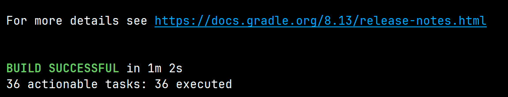
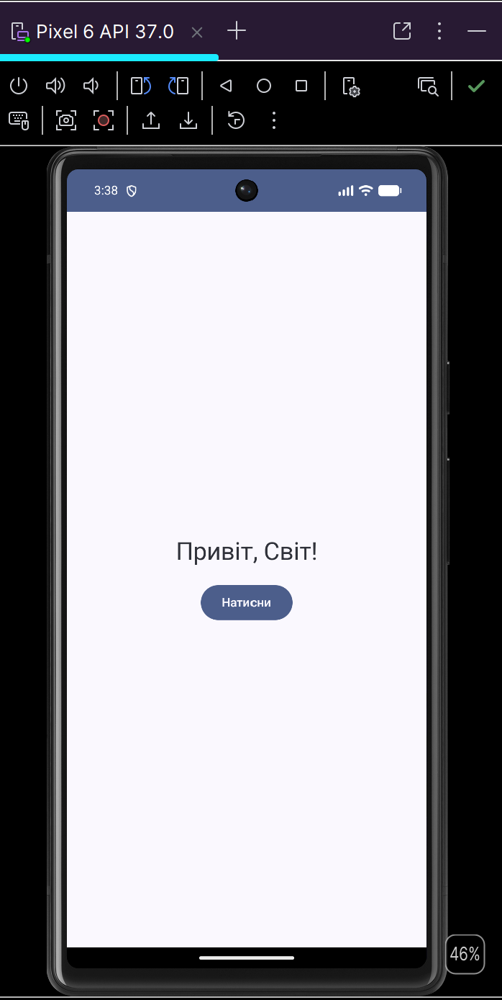
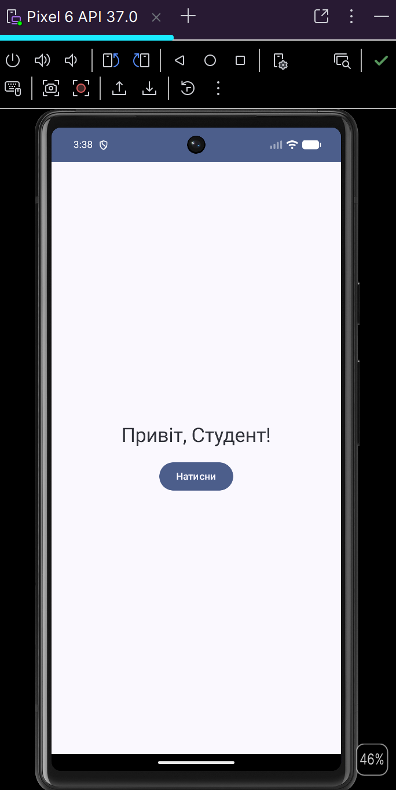
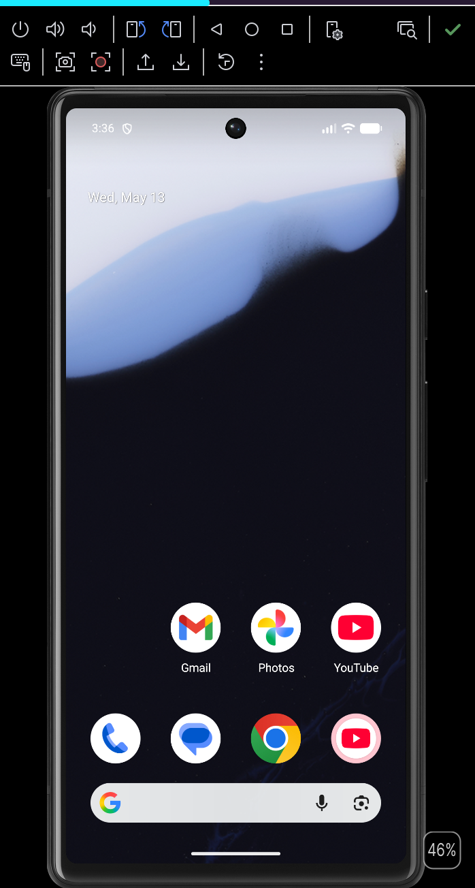

# Hello Compose


Навчальний приклад використання Jetpack Compose — лабораторна робота №1 з дисципліни «Розробка мобільних застосунків».

## Опис
Простий застосунок, який демонструє базові концепції Jetpack Compose:
- декларативний UI
- стан компонента через `remember` + `mutableStateOf`
- обробку подій (натискання кнопки)
- Material 3 темізацію

## Скріншоти
<p align="center">
  
  
</p>
<p align="center">
  
  
</p>

## Як запустити
1. Встановіть Android Studio (версия Hedgehog або новіша).
2. Клонуйте репозиторій:
   ```bash
   git clone https://github.com/MurphyLawdenn/hellocompose.git
   cd hellocompose
   ```
3. Відкрийте проект у Android Studio.
4. Дочекайтеся синхронізації Gradle.
5. Запустіть додаток на эмуляторі або реальному пристрої через кнопку **Run** або командою:
   ```bash
   ./gradlew assembleDebug
   ```

## Перевірка проекту
Для запуску лінтера та тестів використовуйте:
```bash
./gradlew lintDebug
./gradlew test
```

## Структура проекту
```
HelloCompose/
├── app/
│   └── src/main/
│       ├── java/com/example/hellocompose/MainActivity.kt
│       └── res/
├── .github/
│   ├── ISSUE_TEMPLATE/
│   ├── PULL_REQUEST_TEMPLATE.md
│   └── workflows/android-ci.yml
└── .gitignore
```

## GitFlow
Проект використовує модель GitFlow з гілками:
- `main` — продакшн-релізи
- `develop` — основна гілка розробки
- `feature/*` — нові фічі
- `release/*` — підготовка до релізу
- `hotfix/*` — термінові виправлення

## Автор
Білоус Владислав, група К-31, Ірпінський фаховий коледж економіки та права.
